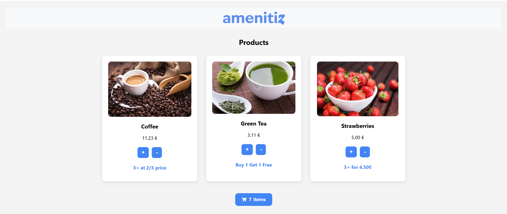
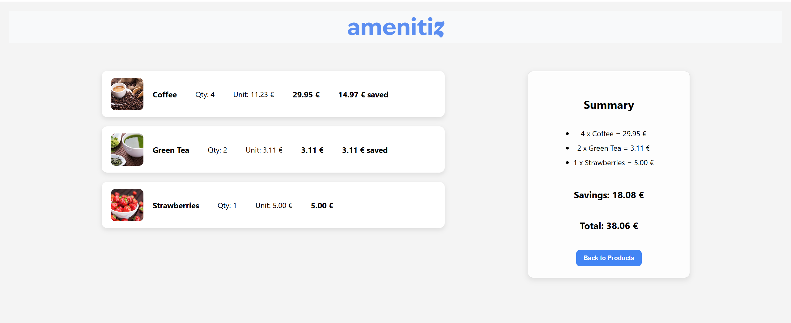

# Amenitiz POS - Growth Engineer Assessment

This project is a web-based point-of-sale (POS) system built for the **Amenitiz Growth Engineer Assessment**. It consists of a full-stack application using **Django** for the backend and **React** for the frontend. The goal is to simulate a checkout experience where products can be added to a virtual cart, discounts are applied based on business rules, and a final summary is displayed.

---

## Features

- 🛍️ Browse products in a responsive product catalog.
- ➕ Add and remove products from the cart.
- 💰 Checkout interface with a detailed summary of items, pricing, discounts, and savings.
- 💸 Dynamic pricing rules for Green Tea (GR1), Strawberries (SR1), and Coffee (CF1).
- 🔧 All discounts and totals are calculated in the backend for consistency and extensibility.
- 🧪 Comprehensive test coverage for core business logic and API responses.

---

## Technologies Used

- **Frontend**: React (functional components, Hooks), CSS (custom styling, Flexbox)
- **Backend**: Django (views, models, routing), MySQL, Django JsonResponse
- **Logic**: Discounts implemented in `calculate_total()` with support for easily adding new rules
- **Testing**: Django's `TestCase` framework used for unit and integration tests
- **Version Control**: Git and GitHub used for incremental development, versioning, and collaboration

---

## Business Rules Implemented

- **GR1 (Green Tea)**: Buy-one-get-one-free
- **SR1 (Strawberries)**: Price drops to €4.50 if buying 3 or more
- **CF1 (Coffee)**: Price drops to 2/3 of original if buying 3 or more

These pricing rules are modular and encapsulated, making the logic easily extendable.

---

## Development Principles

The application was developed with the following software engineering principles in mind:

- **Test-Driven Development (TDD)**: Development followed an iterative and incremental approach where each functional unit was built alongside dedicated unit and integration tests.
- **Reusability and Extensibility**: The backend pricing logic is independent from product data, making it adaptable to new product types or promotions. The frontend does not hardcode any product information; it consumes dynamic data from the API, making the application highly flexible.
- **Readability and Maintainability**: Code is well-structured, with descriptive names and explanatory comments throughout.
- **Usability and Simplicity**: The interface is user-friendly, clean, and responsive, ensuring a smooth experience with intuitive interaction.
- **Modular Architecture**: The application follows a clean separation of concerns: the backend exposes product and checkout data through a REST API, and the frontend handles rendering and user interaction independently.

---

## Running the Project

1. Clone the repository:
   ```bash
   git clone https://github.com/<your-username>/Amenitiz-CashRegister.git
   ```

2. Navigate to the backend Django project:
   ```bash
   cd amenitiz
   python manage.py runserver
   ```

3. In a separate terminal, start the React frontend:
   ```bash
   cd frontend
   npm install
   npm start
   ```

4. Access the app at [http://localhost:3000](http://localhost:3000)

---

## Screenshots

### 🛍️ Product Catalog
Displays available products with images, prices, and promotional rules.



### 🧾 Checkout Summary
Shows quantity, price per item, subtotal, savings, and total.



---

## Running the Tests

Inside the Django backend directory:
```bash
python manage.py test
```

This will execute the full test suite, which includes:

- **Model tests** – Ensures that products can be correctly created and saved in the database.
- **Utility function tests** – Validates all pricing rules in `calculate_total()` 
- **API endpoint tests** – Verifies correct behavior of `/products/api/` and `/checkout/` routes.
- **Edge case tests** – Checks responses for invalid or mixed product codes.

All tests are implemented using Django's `TestCase` class for modularity and isolation.

---

## Author

Andrea Seghetto — Developed as part of the Amenitiz Growth Engineer Assessment